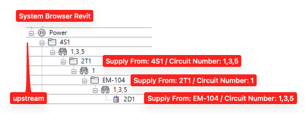

# Revit BIM

Revit R25 model (Architectural, Mechanical, Electrical, Plumbing).

All 3 MEP files are linked from the Architectural model.

All assets in the 3 MEP models have unique values for the instance parameter "Mark". These symbols are used on Schedules and in the Semantic Model as identifiers.

**Updated version (Feb 21)** of the BIM including a new Mechanical Room with Transformer, Meter, and Panels.

All Assets in this updated version also have a type parameter "Semantic Class" which contains either the s223 or the brick class. This makes it easier to convert the model to a semantic model.

[RE1_Electrical_Schedule.xlsx](RE1_Electrical_Schedule.xlsx)

**Updated vesion (Mar 12)** cleaned up relationships between all elements in Mechanical Room. All elements are modeled as panels. Their uptream relationships are captured with the automatic Revit parameter "Supply From" with the value of the upstream panel.

[Revit R25: RE1 Revit 2025_2026-03-12](../revit-bim/RE1 Revit 2025_2026-03-12.zip)

